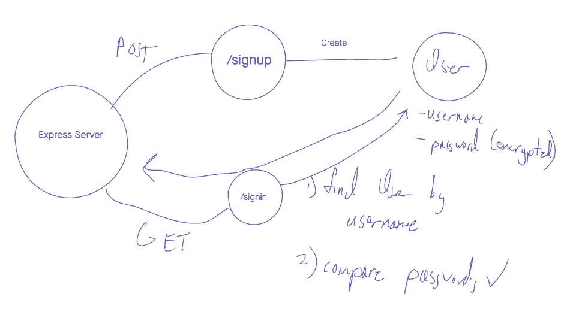

# basic-auth

June 23, 2021

## Description

A RESTful api that supports basic authentication

## Start up

Clone the repo from github, and install the necessary dependencies.

```BASH
npm i
npm start
```

## UML



## Routes

### /signup

#### POST

* Status code: 201
* Inputs:
  * username: `STRING`, `required = true`
  * password: `STRING`, `required = true`
* JSON response:
  * Returns a newly created `user` record
  * username: `STRING`
  * password: `STRING`
  * createdAt: `STRING`
  * updatedAt: `STRING`

```JSON
{
  "id": 1,
  "username": "cullenSharp",
  "password": "$2b$10$VAZDn1G6pZ25SO5spzFN1Ows.cc5NqaDek80Xy3GO9VyKPaPXq5V6",
  "createdAt": "2021-06-23T17:31:40.419Z",
  "updatedAt": "2021-06-23T17:31:40.419Z"
}
```

### /signin

#### POST

* Status code: 200
* Inputs:
  * authorization header
  * `username` and `password` encoded in base64
* JSON response:
  * Returns a previously created `user` record
  * username: `STRING`
  * password: `STRING`
  * createdAt: `STRING`
  * updatedAt: `STRING`

```JSON
{
  "id": 1,
  "username": "cullenSharp",
  "password": "$2b$10$VAZDn1G6pZ25SO5spzFN1Ows.cc5NqaDek80Xy3GO9VyKPaPXq5V6",
  "createdAt": "2021-06-23T17:31:40.419Z",
  "updatedAt": "2021-06-23T17:31:40.419Z"
}
```

## Contributors

Tim Egorov, Tek Jones.

<!--  -->